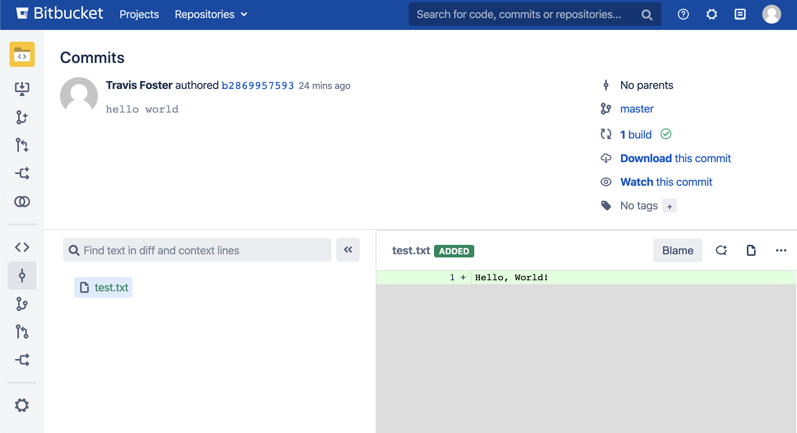
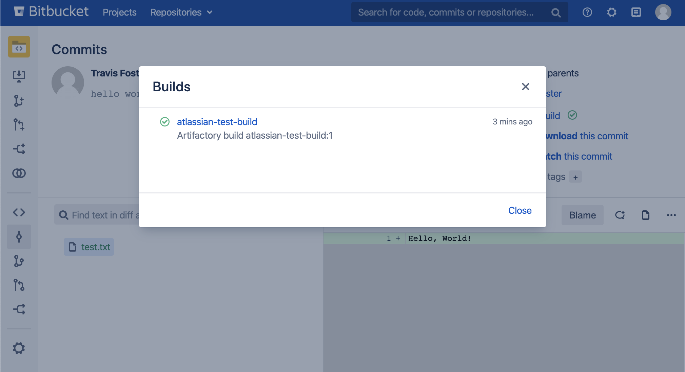

# Artifactory Atlassian Integration User Plugin

This plugin provides some integration with Atlassian Bitbucket Server. It allows
commits in Bitbucket to provide information and links to associated builds in
Artifactory.

## Usage

When a build is deployed in Artifactory, the plugin automatically sends the
build information to the configured Bitbucket Server. Bitbucket then adds the
build to the appropriate commit, accessible through the "Builds" link in the top
right:





## Configuration

The `atlassian.json` file should be modified to allow the plugin to access the
Bitbucket server:

``` json
{
    "bitbucketUrl": "http://localhost:7990",
    "username": "admin",
    "password": "password"
}
```

The URL, username, and password should be changed to the correct location and
login credentials.
